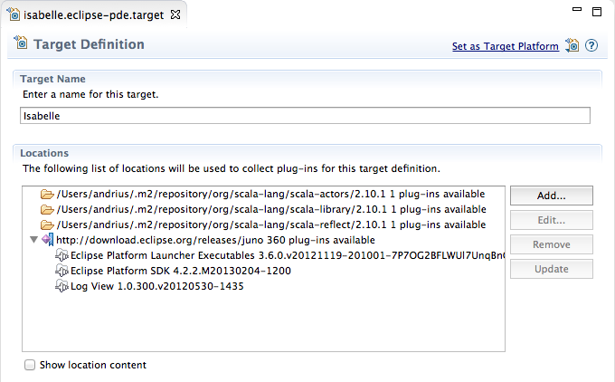
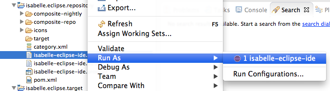

# Developer information

In this page you will learn what is needed to setup Isabelle/Eclipse project in Eclipse (or build it from command-line). After this you should be able to start hacking the Isabelle/Eclipse sources!

## Requirements

-   [JDK 7][jdk7]: Isabelle/Scala requires Java 7
-   [Maven 3][mvn]
-   [Git][git] ([SourceTree][sourcetree] is an excellent free Git client for Windows or Mac), plus [GitHub][github] account for contributing code.
-   [Eclipse 4.2 (Juno)][eclipse-download], including JDT, PDE and m2e (Maven integration). _Eclipse for RCP and RAP Developers_ is recommended.
-   [Scala IDE for Scala 2.10][scala-ide]. Select the update site for Eclipse 4.2 (Juno). Install using the [Update Manager][update-manager].
-   [Maven integration for Scala IDE][m2e-scala]. Use update site: `http://alchim31.free.fr/m2e-scala/update-site/`

[jdk7]: http://www.oracle.com/technetwork/java/javase/downloads/index.html
[mvn]: http://maven.apache.org/download.html
[git]: http://git-scm.com/
[sourcetree]: http://www.sourcetreeapp.com/
[github]: http://github.com/
[eclipse-download]: http://www.eclipse.org/downloads/
[scala-ide]: http://scala-ide.org/download/current.html
[update-manager]: http://www.vogella.com/articles/Eclipse/article.html#updatemanager
[m2e-scala]: http://github.com/sonatype/m2eclipse-scala
[m2e-scala-updates]: http://alchim31.free.fr/m2e-scala/update-site/


## Clone/fork the project

First you should fork the [Isabelle/Eclipse repository][repo]. It will greatly simplify the process of contributing your code to Isabelle/Eclipse. If you are new to GitHub, [read here to learn how to fork a project][github-fork]. 

Next you need to clone the forked Git repository (or the original one if you are only interested in building the source code). Note that you need to clone recursively (`--recursive`) to checkout the _isabelle-scala_ submodule. The command for cloning the fork should be similar to the following one (replace `<username>` with your GitHub username).

```
git clone --recursive git@github.com:<username>/isabelle-eclipse.git
```

Make sure to [add an Upstream][upstream] pointing to the original Isabelle/Eclipse Git remote repository, so that you can keep fetching the latest changes made in the project, and easily integrate them back in your fork.

[repo]: http://github.com/andriusvelykis/isabelle-eclipse
[github-fork]: http://help.github.com/fork-a-repo/
[upstream]: http://help.github.com/fork-a-repo/#Set-Up-Your-Local-Repo


## Build using command-line

The project is uses Maven build system and can be built wholly using the standard Maven command:

```
mvn clean install
```

Run this command from the terminal in the repository root directory. This will build all plug-ins, features and the p2 repository + Isabelle/Eclipse IDE product. The output artefacts are available from the following directories:

- _/isabelle.eclipse.repository/target/products/_ - standalone Isabelle/Eclipse IDE distributions for all supported platforms (Windows, Mac and Linux).
- _/isabelle.eclipse.repository/target/repository/_ - Isabelle/Eclipse p2 repository (update site), you can use it in the Update Manager.

This should be used to produce the products and update site instead of using the GUI export tools in Eclipse IDE. For everyday development, however, import the projects into Eclipse.


## Import the projects into Eclipse

To import Isabelle/Eclipse projects into Eclipse, select **File > Import > Maven > Existing Maven Projects**. Use the checked-out repository as the **Root Directory**. All Isabelle/Eclipse projects will be listed in **Projects** field. Ensure all are selected and click **Finish**.

This will import all Isabelle/Eclipse modules (plug-ins, features, etc.) into Eclipse as Maven projects. Note that Eclipse may ask to install additional Maven connectors, such as _Tycho Project Configurators_ during import - allow that and restart Eclipse if asked.

The projects will now be imported into Eclipse, but there may be build errors. Set the correct target platform to provide all dependencies as per instructions below.


## Set target platform

The target platform comprises all dependencies available for building Isabelle/Eclipse plug-ins. It is defined in _isabelle.eclipse.target_ project. Open the target file at **/isabelle.eclipse.target/target/isabelle.eclipse-pde.target** within Eclipse. Note that this is not the root target file in the project, but the one in the _target_ folder.



When the target definition file is opened, wait for some time until its contents are resolved. Then select **Set as Target Platform** in the top-right of the editor. These dependencies will be loaded for use in builds and all Isabelle/Eclipse projects should build successfully now. Note that this needs to be done once at the beginning and then only if the dependencies/target platform change (close the target file afterwards to avoid unnecessary resolution).

If you still encounter build errors, try refreshing the projects (select all and choose **File >Refresh**) or cleaning them (**Project > Clean**).


## Launch Isabelle/Eclipse from within Eclipse

For convenience, a launch configuration is provided to start Isabelle/Eclipse from the checked-out projects. It defines all features and plug-ins that are required for Isabelle/Eclipse.

Select the launch configuration at **/isabelle.eclipse.repository/isabelle-eclipse-ide.launch**. Choose **Run As > isabelle-eclipse-ide** in the context menu.



This will launch Isabelle/Eclipse as a separate application. All your changes will be reflected in the launched program. The launch configuration will also now be available in the main **Run** and **Debug** toolbars for convenient access. Use this launch configuration to run and debug Isabelle/Eclipse.
