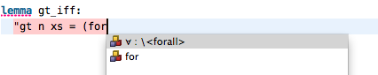

# Content assist

To enter mathematical symbols, use content assist function available in the editor (alternatively use [_Symbols_ view](symbols-view.html)). Content assist provides a selection of completions for partially-typed commands.

Content assist can be invoked by typing part of the word and pressing **Ctrl + Space**. The keyboard shortcut can be changed (e.g. it clashes with _Spotlight_ tool on Mac OS X) in preferences: **Preferences > General > Keys >** (search for) **Content Assist**.
