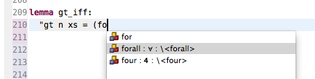

# Content assist

To enter mathematical symbols, use content assist function available in the editor (alternatively use [_Symbols_ view](symbols-view.html)). Content assist provides a selection of completions for partially-typed commands.

Content assist can be invoked by typing part of the word and pressing **Ctrl + Space**. The keyboard shortcut can be changed (e.g. it clashes with _Spotlight_ tool on Mac OS X) in preferences: **Preferences > General > Keys >** (search for) **Content Assist**.

Content assist tool provides available completions that match the entered text. The suggestions include both keywords and symbol abbreviations (screenshot below).

Abbreviations are matched everywhere. For other symbols, ensure you are writing a new word (e.g. `forall`) or start the symbol with `\<`, e.g. `\<forall>`.

Content assist is opened automatically when `\` character is entered, or when one of abbreviation symbols is typed.

## Automatic symbol decoding

Isabelle symbols written in text form, e.g. `\<forall>`, will be automatically decoded when a space or new line is added after the text.

Automatic decoding also applies when new text is pasted into the Isabelle theory editor - text contents will be decoded if they contain Isabelle symbols.
