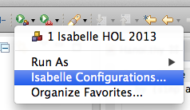
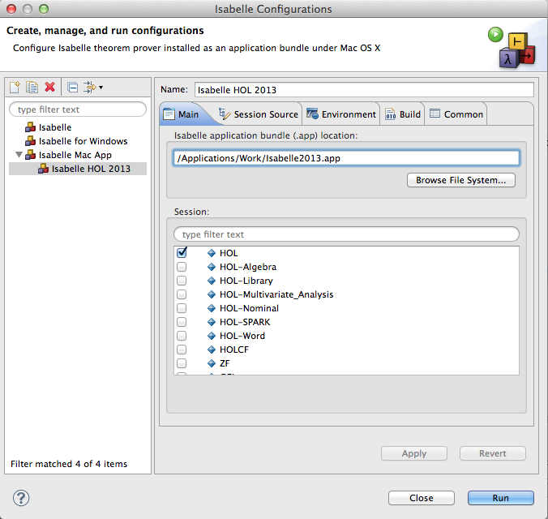
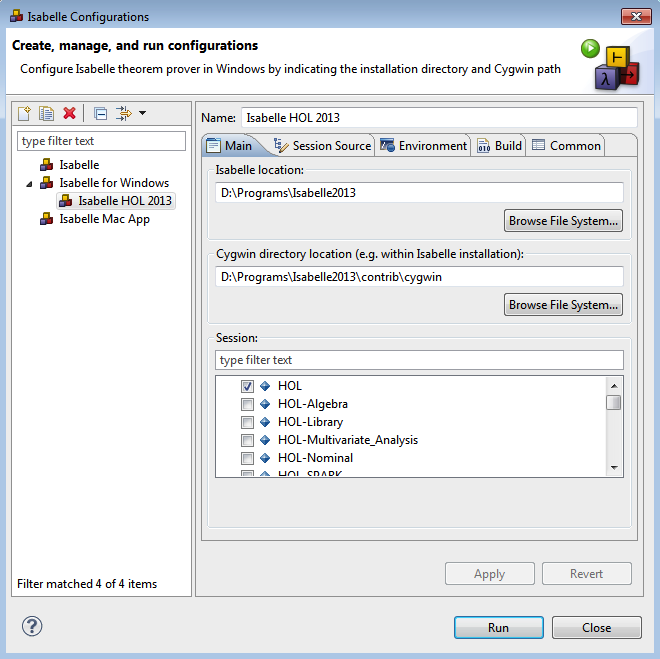
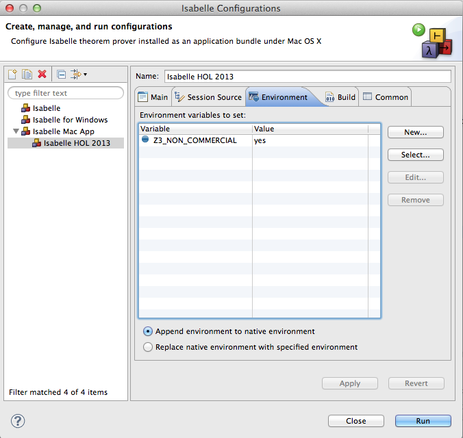
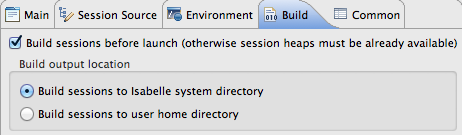

# Isabelle launch configurations

Isabelle/Eclipse provides prover IDE to use with Isabelle theorem prover. To start proving, you need to select and launch an Isabelle distribution and session. Isabelle/Eclipse allows multiple such _launch configurations_ to be set up.

The launch configurations can be managed by selecting **Run > Isabelle > Isabelle Configurations...** or the corresponding toolbar drop-down button :

_Note: the toolbar and menu items afterwards allow quickly launching the last Isabelle configuration again._

## Select Isabelle installation and session

When configuring Isabelle to launch, you need to indicate where Isabelle is located and what session will be loaded. When launched, the selected session will be built and its theories will be available for use within proof. Further optional settings can also be configured - they are presented later in this page.

Select the Isabelle launch type suitable for your operating system:

-   **Isabelle**: for Linux and Mac OS X to indicate Isabelle home directory
-   **Isabelle Mac App**: for Mac OS X to select Isabelle application bundle (e.g. _Isabelle2013.app_)
-   **Isabelle for Windows**: for Windows to indicate Cygwin path in addition to Isabelle home directory ([see below](#Windows)).

Either double-click the selected type or use **New** button to create a new launch configuration (screenshot above).

Select Isabelle home directory in the first field (or application bundle for Mac). If selected correctly, the available sessions will be loaded and listed in the **Session** area below. Choose the session (e.g. **HOL** for Isabelle/HOL) and click **Run** to launch Isabelle prover with this configuration.

_The initial launch may take some time because it would build the selected session. The progress is reported in the bottom-right corner of the IDE and in the Progress view. Subsequent launches with the same session would not rebuild it and thus would be faster._

### Windows

Isabelle on Windows requires a [Cygwin][cygwin] directory to be indicated as well. Isabelle distributions bundle Cygwin, so if one is available in the chosen Isabelle home directory, it will be selected automatically.

[cygwin]: http://www.cygwin.com/

## Further configuration

Isabelle launch can be further configured with additional environment variables, build settings, etc.

### Environment variables

Some of Isabelle's functionality can be customised via certain environment variables, e.g. enabling Z3 for non-commercial use. Refer to Isabelle's documentation for available options.

To set environment variables for Isabelle process, use **Environment** tab in the configuration dialog.

### Additional session directories

When using sessions not available within official Isabelle distribution, they should be indicated in **Session Source** tab of the configuration dialog. You can add either folders in the workspace or external directories.

When the directory is added, select the session in the list within the **Main** tab.

### Build settings

Selected Isabelle session is built during the launch for use in the proof. Some configuration options regarding the build process are available in **Build** tab.

