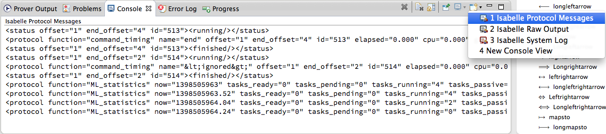
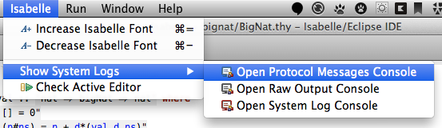

# Low-level output

_The following text is adapted from [Isabelle/jEdit documentation][isa-jedit-doc]._

Prover output is normally shown directly in the [main editor area][editor] or secondary [_Prover output_][output] views. Beyond the normal prover output, it is occasionally useful to inspect low-level output channels via some of the following additional consoles.

[editor]: theory-editor.html
[output]: prover-output.html

## Protocol messages

_Protocol messages console_ shows internal messages between the Isabelle/Scala and Isabelle/ML side of the PIDE editing protocol. Recording of messages starts when the console is opened; earlier messages are lost.

Actual display of protocol messages causes considerable slowdown, so it is important to close the low-level output consoles for production work.

## Raw output

_Raw output console_ shows chunks of text from the `stdout` and `stderr` channels of the prover process. Recording of output starts when the console is opened; earlier output is lost.

The implicit stateful nature of physical I/O channels makes it difficult to relate raw output to the actual command from where it was originating. Parallel execution may add to the confusion. Peeking at physical process I/O is only the last resort to diagnose problems with tools that are not fully PIDE compliant.

Under normal circumstances, prover output always works via managed message channels (corresponding to `writeln`, `warning`, `error` etc. in Isabelle/ML), which are displayed by regular means within the document model.

## System log

_System log console (syslog)_ shows system messages that might be relevant to diagnose problems with the startup or shutdown phase of the prover process; this also includes raw output on stderr.

A limited amount of syslog messages are buffered, independently of whether the _System log console_ is open. This allows to diagnose serious problems with Isabelle/PIDE process management, outside of the actual protocol layer.

Under normal situations, such low-level system output can be ignored.

[isa-jedit-doc]: http://isabelle.in.tum.de/dist/Isabelle2013-2/doc/jedit.pdf

## Opening system consoles

All low-level consoles are available within the Eclipse _Console_ view. Each console can be opened via the **Open Console** button:

Alternatively, each console can be opened via the main menu. Select the corresponding console menu item within **Isabelle > Show System Logs** submenu:

