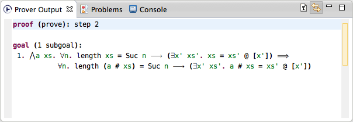

# Prover output

Isabelle proof results can be inspected in the _Prover Output_ view. It displays results of the currently selected command in the editor.

If the proof has been successful, the output view displays outstanding goals or similar information. In case of failed or erroneous commands, the error message can also be inspected there.

The prover output view features syntax highlighting, [rich tooltips](tooltips.html) and [hyperlinks to definitions](go-to-definition.html) just like the main editor.

Normally the prover output follows the command selection in the editor. To disable that temporarily (e.g. to keep the prover output while browsing a theory), toggle the **Link with Editor** button .

## Prover tracing output

To view detailed information about proof trace, you can enable prover tracing using various Isabelle commands (refer to Isabelle documentation for details). For example, to enable _simplifier_ tracing, add the following statement to your theory file:

    declare [[simp_trace]]

This will enable simplifier tracing for everything below the declaration.

Use the prover output to view this tracing information. To control whether tracing information is displayed in the output view, use the **Show Proof Trace** button .

If tracing messages exceed a limit, they are paused and a message "Tracing paused.  Stop, or continue with next 100, 1000, 10000 messages?" is displayed. Select one of the options or adjust the default limit in _\<ISABELLE\_HOME\>/etc/options_, value `editor_tracing_messages`.
