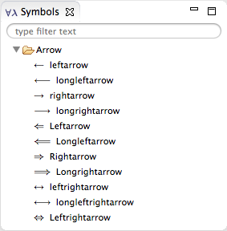

# Symbols view

The _Symbols_ view lists all symbols available to use in Isabelle theory. **Double-click** the symbol to insert it into the open editor.

The symbols are grouped and can be searched by using the filter field.
