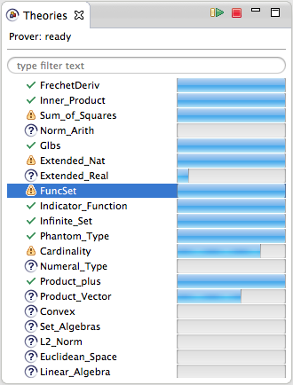

# Theories view

The _Theories_ view provides a high-level overview of the currently open theories and their automatically-loaded dependencies.

The progress bars display how much of each theory has been processed. Furthermore, the status of each theory is indicated by the icon: theories with errors, warnings, finished or unfinished jobs can be identified at a glance.

**Double-click** a theory in the list to open it in an editor.

The theories can be searched by using the filter field.

## Prover status

The top of the _Theories_ view shows the current status of the Isabelle prover.

## Isabelle execution actions

The _Theories_ view also hosts buttons to [cancel the current Isabelle execution and check the active editor](isabelle-execution.html).
