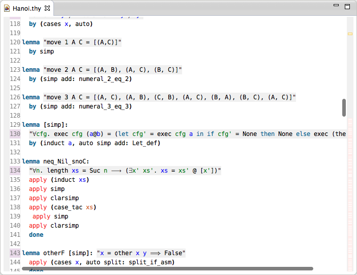

# Isabelle theory editor

Isabelle/Eclipse provides an editor for Isabelle theory files (`*.thy`). If Isabelle prover is running, the visible contents of the editor are submitted to the prover asynchronously. The results and prover feedback are then displayed in the editor.

## Mathematical symbols

To display mathematical symbols (e.g. &forall;) in the editor, Isabelle prover must be running. The symbol definitions are taken from the selected version of Isabelle distribution.

If the prover is not running, the symbols are shown as they are saved, e.g. `\<forall>`. Note that the editor will refresh automatically with correct symbols when Isabelle is launched. During saving mathematical symbols are translated back to their portable definitions.

## Prove-as-you-type

The changes in the editor are automatically sent to the prover. Furthermore, when the editor is opened, its dependencies (imported theories) are also sent to the prover. As the commands are processed by Isabelle, the progress is reported asynchronously in the editor, e.g. red background for _unfinished_ proof commands, etc. The overall progress is also visible on the vertical column on the right side of the editor.

Note that only the visible editor contents are sent to the prover to avoid unnecessary work. Scroll down to the end to submit the whole file.

## Editor features

The theory editor provides a number of features found in modern IDEs:

-   [**Syntax highlighting**](syntax-coloring.html) - note that semantic highlights (e.g. variable types) are only shown for parts submitted to the prover.
-   **Problem markers** - proof errors, warnings and prover messages are displayed in the editor and the Problems view.
-   [**Go to definition**](go-to-definition.html) - jump to the definitions of data types, operators, lemmas, proof commands, etc.
-   [**Content assist**](content-assist.html) - completion suggestions for commands and symbols can be triggered using hotkey.
-   [**Rich tooltips**](tooltips.html) - hover over the proof elements to see their name, type and other information.
-   Line numbers and other features common to Eclipse IDE editors.
