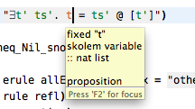

# Tooltips

Hovering over proof elements opens a tooltip with additional information about the element under the cursor.

This provides a lot of information about proof elements without cluttering the editor: 

-   Types of variables and constants (starting with `::`, e.g. `:: nat list` above)
-   Full names of operators, commands, etc.
-   Some command results and prover messages
-   Term kind of the larger area
-   ... and more, depending on the element

This functionality is available both in the Isabelle theory editor and the _Prover Output_ view.

## Annotation tooltips

Hovering over annotation icons on the left side of the editor also produces tooltips with annotation information, such as prover messages, error or warning information, etc.
